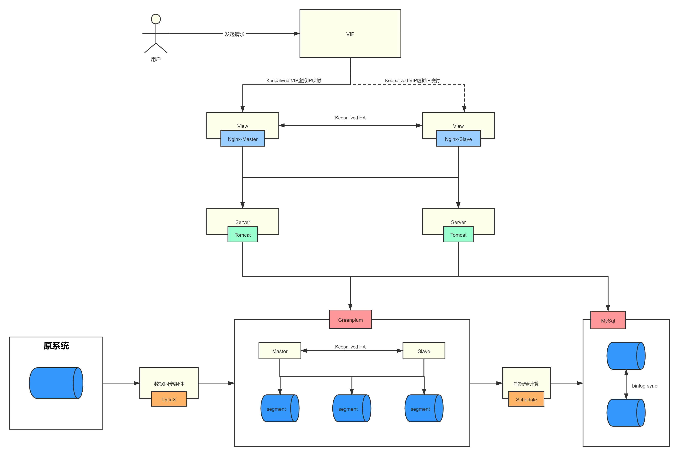

# midnight 午夜

> 分析系统项目脚手架，包含基本web应用，多数据源，前后台连接。

## 架构

## 选型

### 组件版本

|name|version|
|-|-|
|Java|1.8.231|
|MySql|5.7|
|greenplum|Greenplum Database 6.1.0 build dev|

### 前端

|name|version|
|-|-|

### 后端

|name|version|
|-|-|
|Spring Boot|2.2.6.RELEASE|
|Mybatis Plus|1.0.4|